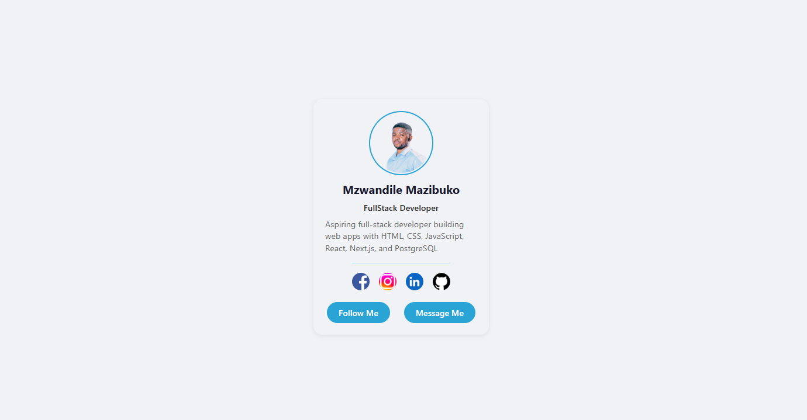

# 🚀 Profile Card Project

A clean and modern **Profile Card UI** built using HTML and CSS. This component is designed to be reusable across multiple projects and can serve as a base for user profiles, portfolios, or dashboard interfaces.

---

## 📸 Preview



---

## 🌐 Live Demo

*  https://mzwandilem.github.io/Profile-card/

---

## 🧩 Features

* Responsive centered layout
* Clean and minimal UI
* Profile image with styled border
* Social media icons section
* Action buttons (Follow & Message)
* Reusable component structure

---

## 🛠️ Tech Stack

* **HTML5**
* **CSS3 (Flexbox)**
* System UI fonts

---

## 📁 Project Structure

```
project-folder/
│── index.html
│── style.css
│── image/
│   ├── profile.png
│   ├── Facebook.png
│   ├── instagram.png
│   ├── linkedin.jpg
│   └── github.png
```

---

## ⚙️ How to Use

1. Clone the repository:

```bash
git clone https://github.com/your-username/profile-card.git
```

2. Open `index.html` in your browser

---

## 🧠 Key Learnings

* Structuring clean HTML components
* Using Flexbox for layout alignment
* Styling reusable UI components
* Managing spacing, typography, and colors

---

## 👤 Author

**Mzwandile Mazibuko**
Aspiring Full Stack Developer

---

## 🌐 Connect

* GitHub: https://github.com/your-username
* LinkedIn: https://shorturl.at/cN76f

---

## 📄 License

This project is open-source and free to use.
